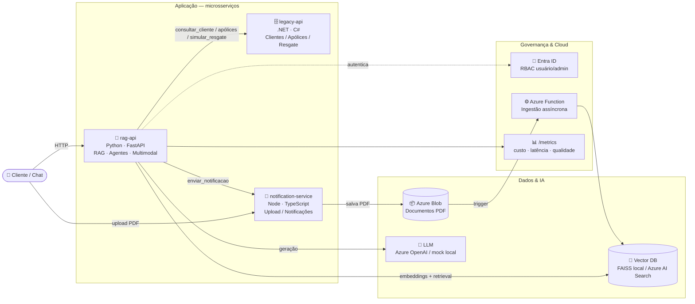
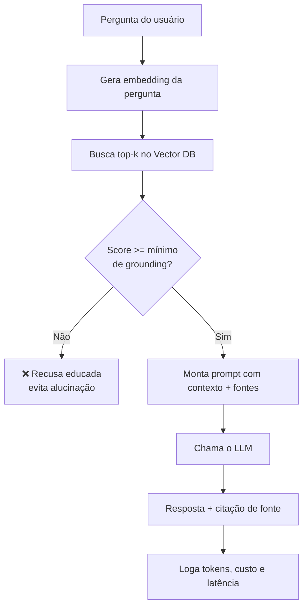
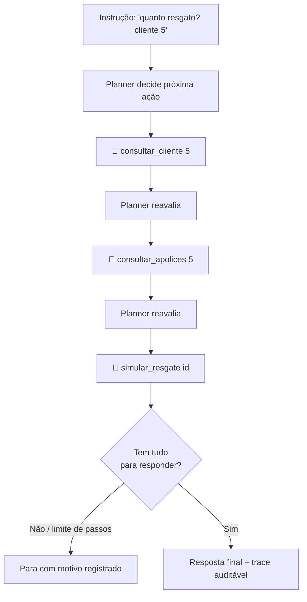
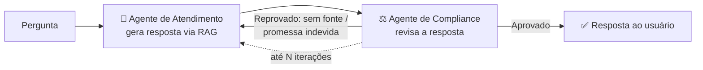

<div align="center">

# 🛡️ Agente Previdência IA

**Assistente corporativo de IA generativa para seguros de vida e previdência**

RAG · Agentes · Multiagentes · Multimodal · Fine-tuning · Deploy Azure

[](https://github.com/matheusmendesd2/agente-previdencia-ia/actions/workflows/ci.yml)
[](LICENSE)

<br/>

### Stack


</div>

---

## 📌 Sobre o projeto

Este repositório simula, ponta a ponta, um **assistente de IA corporativo** para uma
seguradora de vida e previdência (contexto **Caixa Vida e Previdência**). Um cliente
faz uma pergunta em linguagem natural — por exemplo *"quanto consigo resgatar da minha
previdência?"* — e o sistema:

1. **Recupera** informação relevante nos documentos internos (RAG com embeddings + vector DB);
2. **Orquestra um agente** que decide sozinho quais sistemas corporativos consultar
   (clientes, apólices, simulação de resgate) via *tools*;
3. **Revisa a resposta** com um segundo agente de **Compliance**, evitando promessas
   financeiras indevidas e exigindo citação de fonte (*grounding*);
4. **Monitora** custo, latência e qualidade, com **autenticação Entra ID / RBAC** e
   **deploy em Azure** descritos como infraestrutura como código.

> 💡 **Roda 100% localmente e sem custo.** Todos os provedores pagos (LLM, Azure AI Search,
> Azure Vision) têm *fallback* local (LLM mock, FAISS, OCR mock). Basta fornecer as chaves
> reais para promover para produção — sem mudar código.

---

## 🎯 Aderência à vaga (Engenheiro de IA)

Cada requisito da vaga foi mapeado para código executável e testado:

| Área | Requisito | Implementação |
|------|-----------|---------------|
| **Eng. de software** | Node.js | [`services/notification-service`](services/notification-service) |
| | Python | [`services/rag-api`](services/rag-api), [`eval`](eval), [`finetuning`](finetuning) |
| | .NET / C# | [`services/legacy-api`](services/legacy-api) |
| | APIs REST e microsserviços | 3 serviços independentes + `docker-compose.yml` |
| | Arquitetura distribuída | Serviços desacoplados comunicando via HTTP |
| **Cloud / Azure** | App Services, Functions, Storage | [`infra/main.bicep`](infra/main.bicep) |
| | Autenticação (Entra ID, RBAC) | [`services/rag-api/app/auth.py`](services/rag-api/app/auth.py) |
| | Deploy e operação em nuvem | IaC Bicep + endpoint `/metrics` |
| **IA Generativa** | Consumo de APIs de LLM | [`app/llm.py`](services/rag-api/app/llm.py) (Azure OpenAI / OpenAI / Anthropic / mock) |
| | Prompt engineering em produção | [`app/chat.py`](services/rag-api/app/chat.py) |
| | Limitações (alucinação, custo, latência) | *Grounding* + log de custo/latência + `/metrics` |
| | Avaliação de qualidade | [`eval/run_eval.py`](eval/run_eval.py) |
| **RAG (essencial)** | Embeddings | [`app/embeddings.py`](services/rag-api/app/embeddings.py) |
| | Vector database (Azure AI Search) | [`app/vector_store.py`](services/rag-api/app/vector_store.py) |
| | Pipeline de indexação | [`app/rag_pipeline.py`](services/rag-api/app/rag_pipeline.py) |
| | Chunking, retrieval, grounding | `chunker.py` + `/retrieval/buscar` + `chat.py` |
| **Agentes** | Orquestração multi-step + tools | [`app/agent.py`](services/rag-api/app/agent.py), [`app/tools.py`](services/rag-api/app/tools.py) |
| | Integração com APIs corporativas | Tools chamam legacy-api e notification-service |
| | Automações / workflows | Agente + Azure Function de ingestão |
| **Diferenciais** | Multi-agentes | [`app/multiagent.py`](services/rag-api/app/multiagent.py) |
| | Frameworks de avaliação | [`eval/`](eval) |
| | Fine-tuning / tuning de embeddings | [`finetuning/`](finetuning) |
| | IA multimodal | [`app/multimodal.py`](services/rag-api/app/multimodal.py) |
| | Projetos reais em produção | Deploy Azure + observabilidade + governança |

---

## 🏗️ Arquitetura



| Componente | Tecnologia | Papel | Recurso Azure |
|-----------|-----------|-------|---------------|
| `rag-api` | Python / FastAPI | Cérebro: RAG, agentes, multimodal, auth | App Service |
| `legacy-api` | .NET 8 / C# | Sistema legado (clientes, apólices, resgate) | App Service |
| `notification-service` | Node.js / TypeScript | Upload de documentos e notificações | App Service |
| ingestão | Azure Function (Python) | Indexa PDFs do Blob de forma assíncrona | Function App |
| vector DB | FAISS (dev) / Azure AI Search (prod) | Busca semântica | Azure AI Search |
| auth | JWT Bearer | Autenticação e RBAC | Microsoft Entra ID |

---

## 🔄 Como funciona (fluxos principais)

### 1) RAG com *grounding* — `POST /chat/perguntar`



O limiar de *grounding* (`SCORE_MINIMO_GROUNDING`) faz o sistema **recusar** responder
quando não há base documental — a principal defesa contra alucinação.

### 2) Agente autônomo com *tools* — `POST /agente/executar`



O agente executa um **loop multi-step**, escolhendo ferramentas HTTP que integram os
sistemas corporativos, com **limite de passos** e **trace completo** persistido.

### 3) Multiagentes: Atendimento + Compliance — `POST /multiagente/executar`



Um **revisor de Compliance** valida cada resposta (cita fonte? sem promessa financeira?).
Se reprovar, devolve para o Atendimento reescrever — padrão de *reflection* multiagente.

---

## 🚀 Como rodar

### Opção A — Docker (tudo de uma vez)

```bash
docker compose up --build
# rag-api → :8000  |  legacy-api → :8080  |  notification-service → :3000
```

### Opção B — local, serviço a serviço

```bash
# rag-api (Python)
cd services/rag-api
python -m venv .venv && .venv\Scripts\Activate      # Linux/macOS: source .venv/bin/activate
pip install -r requirements.txt
uvicorn app.main:app --port 8000

# legacy-api (.NET)
cd services/legacy-api && dotnet run                 # :8080  (Swagger em /swagger)

# notification-service (Node)
cd services/notification-service && npm install && npm run build && npm start   # :3000
```

Verificar os 3 serviços de uma vez:

```bash
bash scripts/test_health.sh      # espera 3/3 status=ok
```

### Configuração (opcional — para ligar Azure/LLM real)

| Variável | Padrão | Descrição |
|----------|--------|-----------|
| `LLM_PROVIDER` | `local` | `local` (mock), `azure`, `openai`, `anthropic` |
| `VECTOR_STORE` | `local` | `local` (FAISS) ou `azure` (Azure AI Search) |
| `VISION_PROVIDER` | `local` | `local` (OCR mock) ou `azure` (AI Vision) |
| `SCORE_MINIMO_GROUNDING` | `0.3` | Similaridade mínima para responder |
| `ENTRA_TENANT_ID` / `ENTRA_AUDIENCE` | — | Auth Entra ID (RBAC) |

---

## 🌐 Principais endpoints (`rag-api`)

| Método | Rota | Descrição |
|--------|------|-----------|
| `POST` | `/documents/ingest` | Indexa documentos no vector store |
| `POST` | `/retrieval/buscar` | Busca semântica pura (top-k + score) |
| `POST` | `/chat/perguntar` | Chat com grounding, recusa e log de custo |
| `POST` | `/agente/executar` | Agente multi-step com ferramentas |
| `POST` | `/multiagente/executar` | Atendimento + revisor de Compliance |
| `POST` | `/multimodal/extrair` | Extrai dados de imagens (boleto/carteirinha) |
| `GET` | `/metrics` | Dashboard de custo/latência/qualidade *(requer usuário)* |
| `POST` | `/admin/reindex` | Reindexação *(requer admin — RBAC)* |

**legacy-api (.NET):** `/clientes/{id}`, `/clientes/{id}/apolices`, `/apolices/{id}`, `/apolices/{id}/simulacao-resgate`
**notification-service (Node):** `/notify`, `/notify/queue`, `/upload`

---

## ✅ Qualidade & testes

Regressão completa **verde** (80 testes no total):

| Serviço | Comando | Testes |
|---------|---------|--------|
| legacy-api (.NET) | `dotnet test tests/LegacyApi.Tests` | 23 |
| notification-service | `npm test` | 10 |
| rag-api (Python) | `pytest` | 43 |
| eval | `python eval/run_eval.py` | 1 |
| finetuning | `python finetuning/run_all.py` | 3 |

**Métricas de avaliação** ([`eval/relatorio.md`](eval/relatorio.md)): Recall@3 **95%**,
respostas *grounded* **100%**, recusa correta em casos sem base **40%**.
**Fine-tuning de embeddings** ([`finetuning/RESULTADOS.md`](finetuning/RESULTADOS.md)):
comparação base vs. ajustado por Recall@3.

CI (GitHub Actions) constrói os 3 serviços, roda testes, valida o Bicep e executa o
framework de avaliação a cada push.

---

## 📁 Estrutura

```
agente-previdencia-ia/
├── services/
│   ├── rag-api/            # Python · FastAPI — RAG, agentes, multiagentes, multimodal, auth
│   ├── legacy-api/         # .NET · C# — clientes, apólices, simulação de resgate
│   └── notification-service/  # Node · TS — upload e notificações
├── infra/                  # Bicep (IaC) + Azure Function de ingestão
├── eval/                   # Framework de avaliação de qualidade
├── finetuning/             # Tuning de embeddings de domínio
├── docs/                   # Arquitetura e decisões técnicas
├── scripts/                # Health check e build
└── docker-compose.yml
```

Documentação detalhada: [`docs/arquitetura.md`](docs/arquitetura.md) ·
[`docs/decisoes-tecnicas.md`](docs/decisoes-tecnicas.md).

---

## 📄 Licença

[MIT](LICENSE)
