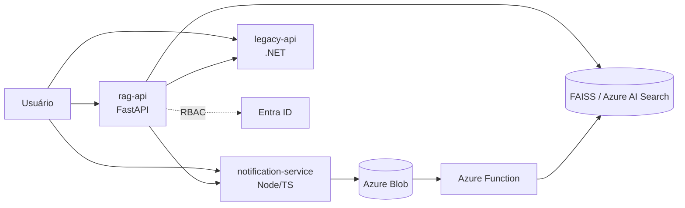

# Agente Previdência IA

[](https://github.com/seu-usuario/agente-previdencia-ia/actions/workflows/ci.yml)

Projeto de portfólio que simula um **assistente corporativo de IA generativa** para uma
empresa de seguros de vida e previdência. Combina **RAG**, **agentes e multiagentes**,
**IA multimodal** e **fine-tuning** em uma arquitetura de microsserviços, com
**deploy em Azure** e **governança (Entra ID/RBAC)**.

> Tudo executável **sem custo** (fallbacks locais: FAISS, sentence-transformers, LLM mock),
> com a integração real Azure documentada e pronta para ligar com uma chave.

## Resumo

O sistema recebe perguntas de clientes (ex.: "quanto resgato da previdência?") e, por meio de
um **agente orquestrador**, decide sozinho quais ferramentas chamar — consulta o sistema legado
de clientes/apólices (.NET), busca nos documentos da seguradora (RAG em Python), simula resgates
e dispara notificações (Node.js). Antes de responder ao usuário, um **agente de Compliance** revisa
a resposta para evitar promessas financeiras indevidas e garantir citação de fonte. Imagens de
boletos/carteirinhas são extraídas via **multimodal**. Qualidade e custo são monitorados por um
**framework de avaliação** e um dashboard de métricas.

## Arquitetura



Ver [`docs/arquitetura.md`](docs/arquitetura.md) para o diagrama completo e fluxo de dados.

## Como rodar localmente

```bash
docker compose up --build
```

Sem Docker (cada serviço em seu terminal):

```bash
# rag-api
cd services/rag-api && python -m venv .venv && .venv/Scripts/Activate && pip install -r requirements.txt
uvicorn app.main:app --port 8000

# legacy-api
cd services/legacy-api && dotnet run

# notification-service
cd services/notification-service && npm install && npm start
```

Health check dos 3 serviços: `bash scripts/health-check.sh` (ou `scripts/health-check.ps1`).

## Como rodar os testes

| Serviço | Comando |
|--------|---------|
| legacy-api (.NET) | `dotnet test tests/LegacyApi.Tests` (23 testes) |
| notification-service | `cd services/notification-service && npm test` (10 testes) |
| rag-api (Python) | `cd services/rag-api && pytest` (43 testes: RAG, chat, agente, multiagente, multimodal, auth) |
| eval | `cd eval && python run_eval.py` (gera `eval/relatorio.md`) |
| finetuning | `cd finetuning && python run_all.py` (gera `finetuning/RESULTADOS.md`) |

## Tabela de rastreabilidade (requisito → fase)

| Requisito da vaga | Fase | Onde |
|-------------------|------|------|
| Node.js | 2 | [`services/notification-service`](../services/notification-service) |
| Python | 3–9 | [`services/rag-api`](../services/rag-api), [`eval`](../eval), [`finetuning`](../finetuning) |
| APIs REST e microsserviços | 0–2 | 3 serviços + `docker-compose.yml` |
| Arquitetura distribuída | 0 | `docker-compose.yml` (3 serviços separados) |
| .NET / C# | 1 | [`services/legacy-api`](../services/legacy-api) |
| Azure (App Services, Functions, Storage) | 10 | [`infra/main.bicep`](../infra/main.bicep) |
| Autenticação (Entra ID, RBAC) | 10 | [`services/rag-api/app/auth.py`](../services/rag-api/app/auth.py) |
| Deploy e operação em nuvem | 10 | IaC Bicep + `/metrics` |
| Consumo de APIs de LLM | 4 | [`services/rag-api/app/llm.py`](../services/rag-api/app/llm.py) |
| Prompt engineering em produção | 4 | [`services/rag-api/app/chat.py`](../services/rag-api/app/chat.py) |
| Limitações (alucinação, custo, latência) | 4, 9 | grounding + log de custo + `eval/` |
| Avaliação de qualidade das respostas | 9 | [`eval/run_eval.py`](../eval/run_eval.py) |
| Embeddings | 3, 8 | [`services/rag-api/app/embeddings.py`](../services/rag-api/app/embeddings.py) |
| Vector database (Azure AI Search) | 3 | [`services/rag-api/app/vector_store.py`](../services/rag-api/app/vector_store.py) |
| Pipeline de indexação de documentos | 3 | [`services/rag-api/app/rag_pipeline.py`](../services/rag-api/app/rag_pipeline.py) |
| Chunking, retrieval, grounding | 3, 4 | `chunker.py`, `/retrieval/buscar`, `chat.py` |
| Orquestração de agentes (multi-step, tools) | 5 | [`services/rag-api/app/agent.py`](../services/rag-api/app/agent.py) |
| Integração com APIs corporativas | 5 | `tools.py` (legacy-api, notification-service) |
| Automações e workflows | 5, 6 | agente + Function de ingestão |
| Multiagentes | 6 | [`services/rag-api/app/multiagent.py`](../services/rag-api/app/multiagent.py) |
| Frameworks de avaliação de modelos | 9 | `eval/` |
| Fine-tuning e tuning de embeddings | 8 | [`finetuning/`](../finetuning) |
| IA multimodal | 7 | [`services/rag-api/app/multimodal.py`](../services/rag-api/app/multimodal.py) |
| Projetos reais em produção com LLMs | 10–11 | deploy + docs |

## Licença

[MIT](LICENSE)
